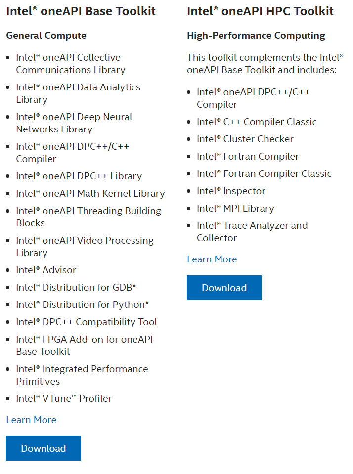

# Intel oneAPI

## 介绍

CMA MESO 5.1 模式安装需要C/Fortran编译器以及MPI并行库。Intel oneAPI提供了C/Fortran编译器以及Intel MPI库，它的编译器优化做的很好，而且现在可以免费使用，优先推荐。

Intel oneAPI包含多个组件用于不同用途，针对数值模式安装运行选择以下两个组件即可。

 - Intel oneAPI Base Toolkt
 - Intel oneAPI HPC Toolkit

两个组件里包含的软件如下截图所示：

  

官方网站链接：[Intel oneAPI](https://www.intel.com/content/www/us/en/developer/tools/oneapi/toolkits.html)

Intel oneAPI下载安装方式多样，可根据安装机器平台环境进行选择。

本文示例机器操作系统为：Arch Linux。

安装方式为：选择Linux平台的离线安装包下载后离线安装。下载页面会提示如何安装。

  

你可以选择使用管理员权限安装在系统路径，也可以安装在个人目录下。

## 安装

首先安装BaseKit：

```bash
# 管理员权限安装命令
sudo sh l_BaseKit_p_2022.2.0.262_offline.sh

# 普通用户安装
sh l_BaseKit_p_2022.2.0.262_offline.sh
```

根据提示一步步往下确认即可。

在安装HPCkit前在shell配置文件里添加BaseKit环境变量，并使shell配置生效。

```bash
vi ~/.bashrc

source /opt/intel/oneapi/setvar.sh #根据实际安装路径设定
```

下一步安装HPCkit：

```bash
# 管理员权限安装命令
sudo sh l_HPCKit_p_2022.2.0.191_offline.sh

# 普通用户安装
sh l_HPCKit_p_2022.2.0.191_offline.sh
```

最后查看编译器命令是否能正常找到

```bash
which ifort
which mpiifort
```